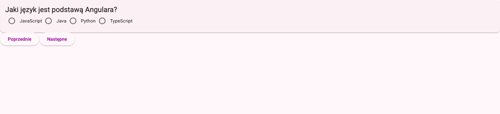

# Zadanie 2. Dodanie komponentu quizu oraz pytania

## Wstęp

W tym zadaniu dodasz do aplikacji nowy komponent `Quiz`, który będzie wyświetlał pytania quizowe. Każde pytanie będzie reprezentowane przez osobny komponent `Question`. Pytania oraz możliwe odpowiedzi będą przekazywane do komponentu `Question` za pomocą właściwości `input`.

## Wynik końcowy



## Kroki do wykonania

1. **Wygeneruj nowy komponent i dodaj routing**:

    Wygeneruj komponent `Quiz` za pomocą Angular CLI, tak jak zrobiłeś to w poprzednim zadaniu. Następnie dodaj trasę do tego komponentu w pliku `app.routes.ts`, tak aby była dostępna pod ścieżką `/quiz`.

    Zweryfikuj, czy trasa działa poprawnie, przechodząc do `localhost:4200/quiz`. Powinieneś zobaczyć zawartość nowo utworzonego komponentu (np. "quiz works!").

2. **Zmodyfikuj przycisk w komponencie `Home`**:

    Otwórz plik `home.component.html` i zmień przycisk, aby przekierowywał do nowego komponentu `Quiz`. Możesz to zrobić, używając dyrektywy `routerLink`:

    ```html
    <button routerLink="/quiz">Start Quiz</button>
    ```

    Dyrektywa `routerLink` jest eksportowana przez moduł `RouterModule`. Musimy więc zaimportować ten moduł w pliku `home.component.ts`, aby uniknąć błędów kompilacji. Zrobisz to w podobny sposób, w jaki importowałeś `MatButtonModule` w poprzednim zadaniu.

    Zanim przejdziesz do następnego kroku, upewnij się, że po kliknięciu przycisku "Start Quiz" zostaniesz przekierowany do komponentu `Quiz`.

3. **Stwórz interfejs pytania**:

    Interfejs to inaczej kontrakt, który określa strukturę danych. Aby ułatwić sobie dalszą pracę, dobrze jest najpierw zdefiniować strukturę danych, z jaką będziemy pracować. Utwórz nowy folder w katalogu `app` o nazwie `interfaces`. W tym folderze utwórz plik `question-data.ts`, w którym zdefiniujesz interfejs `QuestionData`:

    ```typescript
    export interface QuestionData {
        id: string;
        question: string;
        options: {
            a: string;
            b: string;
            c: string;
            d: string;
        };
    }
    ```

4. **Stwórz komponent pytania**:

    Jednym ze sposobów, w jaki komponenty przekazjuą sobie dane, są funkcje `input` oraz `output`. W tym kroku utworzymy komponent `Question`, który będzie odpowiedzialny za wyświetlanie pojedynczego pytania quizowego oraz jego możliwych odpowiedzi. Wszystkie dane będą przekazywane do tego komponentu za pomocą właściwości `input`.

    Wygeneruj nowy komponent o nazwie `Question` za pomocą Angular CLI. W wygenerowanym pliku `question.component.ts` dodaj właściwość question:

    ```typescript
    import { Component, input } from '@angular/core';
    import { QuestionData } from '../interfaces/question-data';

    @Component({
        selector: 'app-question',
        imports: [],
        templateUrl: './question.component.html',
        styleUrl: './question.component.scss',
    })
    export class QuestionComponent {
        question = input.required<QuestionData>();
    }
    ```

    - `question` - nazwa właściwości,
    - `input.required` - funkcja, która oznacza, że właściwość jest wymagana i musi być przekazana do komponentu,
    - `<QuestionData>` - określa typ danych, jakie będą przekazywane do tej właściwości.

    Następnie w pliku `question.component.html` dodaj kod HTML, który będzie wyświetlał pytanie oraz jego możliwe odpowiedzi:

    ```html
    <mat-card>
        <mat-card-header>
            <mat-card-title>{{ question().question }}</mat-card-title>
        </mat-card-header>
        <mat-card-content>
            <mat-radio-group>
                @for (option of options(); track option.key) {
                <mat-radio-button [value]="option.key"> {{ option.value }} </mat-radio-button>
                }
            </mat-radio-group>
        </mat-card-content>
    </mat-card>
    ```

    W powyższym kodzie używamy komponentów z Angular Material do wyświetlania pytania w karcie oraz opcji odpowiedzi jako przycisków typu radio. Aby działały poprawnie, musimy zaimportować odpowiednie moduły Angular Material - `MatCardModule` oraz `MatRadioModule`.

    Zauważ również, że używamy pętli `@for`, aby iterować przez opcje pytania. W tym celu musimy dodać właściwość `options` w pliku `question.component.ts`, która będzie przekształcać obiekt opcji na tablicę par klucz-wartość:

    ```typescript
    options = computed(() =>
        Object.entries(this.question().options).map(([key, value]) => ({ key, value }))
    );
    ```

    To wyrażenie może wydawać się skomplikowane, ale w skrócie robi ono następujące rzeczy:

    - `this.question().options` - uzyskuje obiekt opcji z przekazanego pytania,
    - `Object.entries(...)` - konwertuje obiekt na tablicę par klucz-wartość,
    - `map(...)` - przekształca każdą parę na obiekt z właściwościami `key` i `value`.

    Można zwizualizować to jako konwersję z formatu:

    ```typescript
    {
        a: 'Odpowiedź A',
        b: 'Odpowiedź B',
        c: 'Odpowiedź C',
        d: 'Odpowiedź D',
    }
    ```

    do formatu:

    ```typescript
    [
        { key: 'a', value: 'Odpowiedź A' },
        { key: 'b', value: 'Odpowiedź B' },
        { key: 'c', value: 'Odpowiedź C' },
        { key: 'd', value: 'Odpowiedź D' },
    ];
    ```

5. **Użycie komponentu `Question` i przetestowanie działania**:

    Tymczasowo dodamy do komponentu `Quiz` przykładowe pytania oraz użyjemy komponentu `Question`, aby wyświetlić te dane.

    Dodaj do pliku `quiz.component.ts` następujące właściwości:

    ```typescript
    questions = signal<QuestionData[]>([
        {
            id: '1',
            question: 'Czym jest Angular?',
            options: {
                a: 'Biblioteką JavaScript do budowy interfejsów użytkownika',
                b: 'Frameworkiem TypeScript do tworzenia aplikacji webowych',
                c: 'Językiem programowania',
                d: 'Bazą danych',
            },
        },
        {
            id: '2',
            question: 'Jaki język jest podstawą Angulara?',
            options: {
                a: 'JavaScript',
                b: 'Java',
                c: 'Python',
                d: 'TypeScript',
            },
        },
    ]);

    currentQuestionIndex = signal(0);

    currentQuestion = computed(() => this.questions()[this.currentQuestionIndex()]);
    ```

    Następnie zaimportuj komponent `Question` i użyj go w pliku `quiz.component.html`, przekazując do niego aktualne pytanie:

    ```html
    <app-question [question]="currentQuestion()"></app-question>
    ```

    Dodaj również przyciski do nawigacji między pytaniami:

    ```html
    <button matButton="elevated" (click)="previousQuestion()">Poprzednie</button>
    <button matButton="elevated" (click)="nextQuestion()">Następne</button>
    ```

    oraz metody `previousQuestion` i `nextQuestion`, które będą aktualizwać wartość `currentQuestionIndex` za pomocą funkcji [update](https://angular.dev/guide/signals#writable-signals).

## Podsumowanie

Po wykonaniu tego zadania powinieneś mieć działający komponent `Quiz`, który wyświetla pytania quizowe za pomocą komponentu `Question`. Pytania są przekazywane do komponentu `Question` jako właściwość `input`, a użytkownik może nawigować między pytaniami za pomocą przycisków "Poprzednie" i "Następne".

## Pomocna dokumentacja

- <https://angular.dev/api/router/RouterLink> - dyrektywa `routerLink`
- <https://angular.dev/guide/signal-inputs> - przekazywanie danych do komponentu za pomocą `input()`
- <https://angular.dev/guide/signals> - wprowadzenie do sygnałów w Angularze
- <https://angular.dev/guide/control-flow> - składnia pętli `@for`
- <https://angular.dev/guide/user-input> - obsługa zdarzeń użytkownika, np. `(click)`
- <https://material.angular.io/components/card/overview> - dokumentacja komponentu `mat-card`
- <https://material.angular.io/components/radio/overview> - dokumentacja komponentu `mat-radio-button`
