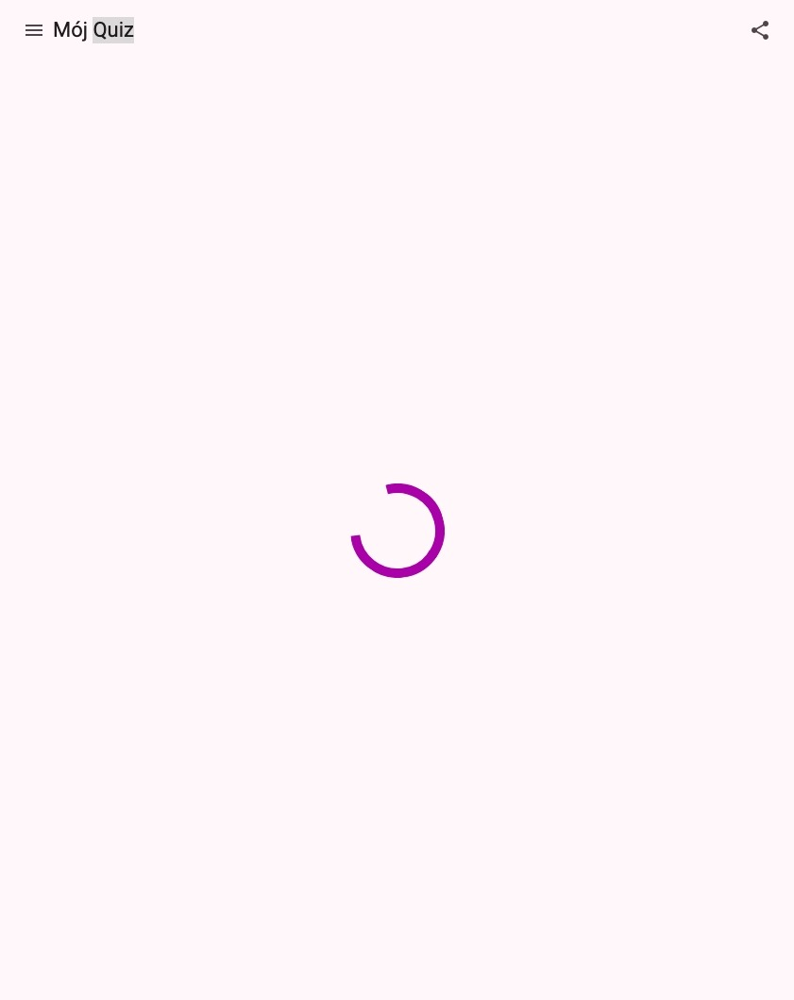

# Zadanie 4. Upiększanie

## Wstęp

W tym zadaniu dodamy do naszej aplikacji wskaźnik ładowania, który będzie wyświetlany podczas pobierania pytań. Dodamy również toolbar - nagłówek aplikacji, aby wypełnić pustą przestrzeń na stronach. Zadanie to nie jest wymagane, aby kolejne funkcjonalności działały poprawnie, ale nauczy Cię używania kolejnych komponentów z Angular Material oraz poprawi wygląd i użyteczność Twojej aplikacji.

## Wynik końcowy


## Kroki do wykonania

1. **Poprawienie UX podczas pobierania pytań**:

    Otwórz aplikację w przeglądarce i przejdź do Developer Tools (F12 lub Ctrl+Shift+I). W zakładce Network znajdziesz ustawienie `No Throttling`. Zmień je na `3G` i kliknij przycisk `Rozpocznij quiz`. Zauważ, że podczas pobierania pytań użytkownik widzi pustą stronę lub niepełne dane.

    Dobrą praktyką jest informowanie użytkownika o trwającym procesie ładowania danych, dlatego dodamy do naszej aplikacji wskaźnik ładowania - `MatProgressSpinner`.

    Do klasy `QuizComponent` dodaj sygnał `isLoading`, który będzie informował, czy pytania są w trakcie pobierania. Następnie w pliku `quiz.component.html` dodaj warunkowe wyświetlanie komponentu `MatProgressSpinner`, gdy `isLoading` jest prawdziwe:

    ```html
    <div class="quiz__container">
        @if (isLoading()) {
        <mat-progress-spinner mode="indeterminate" class="quiz__spinner" />
        } @else { ... }
    </div>
    ```

    Razem z dobrym UX idzie dobre UI, dlatego nie zapomnij dodać odpowiednich styli CSS, aby spinner był wyśrodkowany na stronie. Gdy skończysz, przetestuj aplikację ponownie w trybie 3G, aby upewnić się, że spinner pojawia się podczas ładowania pytań.

    Przed przejściem do nasptępnego kroku, wyłącz throttling w zakładce Network, żebyś nie musiał spędzać kolejnej godziny na debuggowanie strasznie powolnie ładującej się aplikacji :)

2. **Stworzenie komponentu zawierającego toolbar**:

    Aby dodać nagłówek do aplikacji, wygeneruj za pomocą Angular CLI nowy komponent - `Toolbar` i dodaj do jego szablonu prosty toolbar z Angular Material:

    ```html
    <mat-toolbar>
        <button matIconButton><mat-icon>menu</mat-icon></button>
        <span class="toolbar__title" routerLink="/">
            <ng-content></ng-content>
        </span>
        <span class="toolbar__spacer"></span>
        <button matIconButton><mat-icon>share</mat-icon></button>
    </mat-toolbar>
    ```

    Klasa `toolbar__spacer` powinna mieć styl `flex: 1 1 auto;`, aby przyciski były odpowiednio rozmieszczone. Nie zapomnij też o zaimportowaniu odpowiednich modułów w komponencie `Toolbar`: `MatToolbarModule`, `MatButtonModule`, `MatIconModule` oraz `RouterModule`.

    Jeżeli ikony nie wyświetlają się poprawnie, upewnij się, że w pliku `index.html` znajduje się link do czcionek Material Icons:

    ```html
    <link href="https://fonts.googleapis.com/icon?family=Material+Icons" rel="stylesheet" />
    ```

3. **Użycie komponentu `Toolbar`**:

    Zazwyczaj zależy nam, aby toolbar był widoczny na każdej stronie aplikacji. W tym celu otwórz plik `app.component.html` i umieść w nim komponent `app-toolbar` nad deklaracją `router-outlet`:

    ```html
    <app-toolbar>{{ title() }}</app-toolbar> <router-outlet />
    ```

    Właśnie poznałeś również sposób na przekazywanie treści pomiędzy komponentami za pomocą `ng-content`. W tym przypadku przekazujemy tytuł aplikacji do komponentu `Toolbar`, który wyświetla go w środku paska narzędzi.

    Przyciski `menu` i `share` nie mają jeszcze żadnej funkcjonalności, ale możesz spróbować dodać do nich jakieś akcje, np. wyświetlenie [dialogu](https://material.angular.dev/components/dialog/overview) lub [paska bocznego](https://material.angular.dev/components/sidenav/overview).

## Podsumowanie

Po ukończeniu tego zadania Twoja aplikacja powinna wyglądać profesjonalnie i być bardziej przyjazna dla użytkownika. Wskaźnik ładowania zapewni lepsze doświadczenie podczas oczekiwania na dane, a toolbar doda strukturę i ułatwi nawigację w aplikacji.

## Pomocna dokumentacja

- <https://angular.dev/guide/control-flow> - składnia bloku warunkowego `@if`
- <https://material.angular.io/components/progress-spinner/overview> - dokumentacja komponentu `mat-progress-spinner`
- <https://material.angular.io/components/toolbar/overview> - dokumentacja komponentu `mat-toolbar`
- <https://material.angular.io/components/icon/overview> - dokumentacja komponentu `mat-icon`
- <https://angular.dev/guide/content-projection> - przekazywanie treści do komponentu za pomocą `ng-content`
